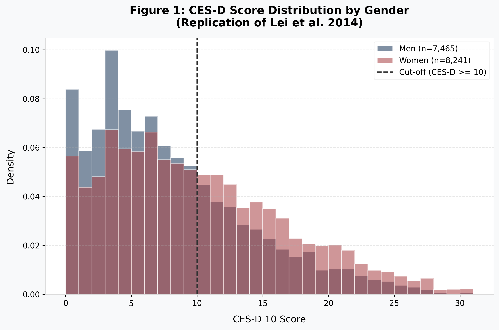

# CHARLS 2011 Empirical Replication (Lei et al. 2014)



## Overview
This repository contains a full **Phase 1 to Phase 4 modular academic replication pipeline** based on the highly cited paper: 
> *Lei, X., Sun, X., Strauss, J., Zhang, P., & Zhao, Y. (2014). Depressive symptoms and SES among the mid-aged and elderly in China: Evidence from the China Health and Retirement Longitudinal Study national baseline. Social Science & Medicine, 120, 224-232.*

This project was built to demonstrate proficiency in handling large-scale micro-survey data (CHARLS), performing stringent demographic filtering, constructing complex sociodemographic scales (CES-D 10, PCE), and running heteroskedasticity-consistent regression analyses.

## Pipeline Architecture

The pipeline is split into four strict, decoupled steps matching a standard Research Assistant workflow:

### 1. `src/01_data_cleaning.py` (Data Engineering)
- Extracts and strictly merges across four CHARLS baseline modules (`demographic_background`, `health_status_and_functioning`, `biomarker`, `weight`).
- Core Filters: `Age >= 45`, dropping unmatched spouses (Final N = 17,222).
- CES-D 10 scale reverse-scoring logic and SES mapping (Education splines, PCE, Rural Hukou).

### 2. `src/02_descriptive_stats.py` (Validation & Reliability)
- Validates the target sample summary statistics (Appendix Table 2).
- Calculates cross-gender baseline differences matching target distributions (Male Mean = ~7.46, Female Mean = ~9.46).

### 3. `src/03_regression_analysis.py` (Modeling)
- Replicates standard OLS cross-sectional models using `statsmodels`.
- Employs **Community-level Clustered Standard Errors** to correctly account for geographic sampling logic.
- Models CES-D scores against incremental controls: demographic, economic (PCE), and geographic baselines.

### 4. `src/04_visualization.py` (Reporting)
- Reconstructs Figure 1 from the paper.
- Uses `matplotlib`/`seaborn` to render publication-grade overlapping density plots visualizing depression trajectories across gender strata.

## Setup & Execution

```bash
# Provide raw CHARLS .dta modules in the /data folder
pip install -r requirements.txt

# Run the pipeline sequentially
python src/01_data_cleaning.py
python src/02_descriptive_stats.py
python src/03_regression_analysis.py
python src/04_visualization.py
```

## Disclaimer
This is an independent empirical exercise built for research portfolio purposes. Original dataset belongs to the China Health and Retirement Longitudinal Study (CHARLS) administered by Peking University.
