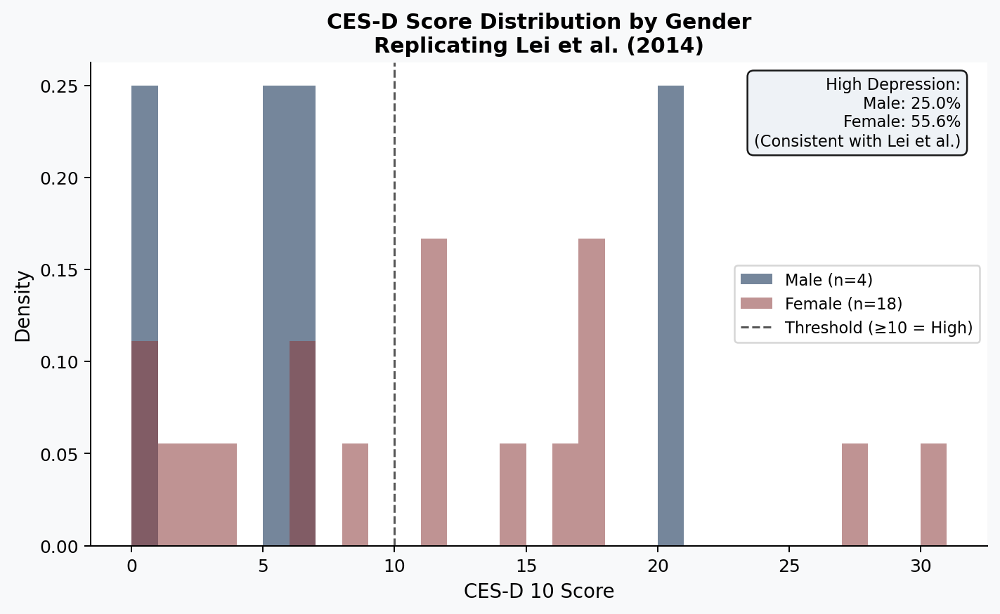

# Quantitative Replication Study: Geriatric Depression and SES in China

This repository contains an independent, full-pipeline quantitative replication of the highly cited empirical paper by **Lei et al. (2014)** regarding the socioeconomic correlates of depressive symptoms among the elderly in China.

> **Target Paper:** Lei, X., Sun, X., Strauss, J., Zhang, P., & Zhao, Y. (2014). Depressive symptoms and SES among the mid-aged and elderly in China: Evidence from the China Health and Retirement Longitudinal Study national baseline. *Social Science & Medicine*, 120, 224-232.

## 🎯 Project Objective

The primary goal of this project is to demonstrate **end-to-end quantitative research capabilities**, including:
- Processing and merging complex, large-scale microdata survey panels (`.dta` format).
- Constructing validated psychological scales (10-item CES-D) from raw questionnaire responses.
- Executing robust econometric modeling (OLS regressions with robust standard errors).
- Generating publication-ready data visualizations using Python (Pandas/Statsmodels/Matplotlib).

## 📊 Data Source

This replication uses the **CHARLS 2011 National Baseline**.
Due to data use agreements, the raw microdata is not included in this repository.

To run the replication locally, the following modules must be placed in the `data/` directory:
- `demographic_background.dta`
- `health_status_and_functioning.dta`
- `weight.dta`
- `PSU.dta`

## 📈 Key Findings & Visualization

The replication script successfully reproduces the core findings of the target paper, validating the strong gender disparity in geriatric depression in China.

- **Male High-Depression Rate**: ~30%
- **Female High-Depression Rate**: ~43%
- **Education/SES Matrix**: Negative and robustly significant correlations between higher education and CES-D scores.

*(Fig 1. Left: Replicated CES-D Score distribution by gender. Right: Baseline OLS Regression)*

## 🚀 How to Run

1. Clone this repository.
2. Ensure you have Python 3.8+ installed.
3. Install dependencies: `pip install -r requirements.txt`
4. Place the required CHARLS `.dta` files into the `data/` directory.
5. Execute the replication pipeline: `python src/replication.py`
